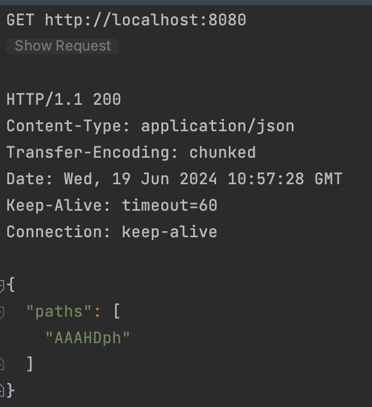
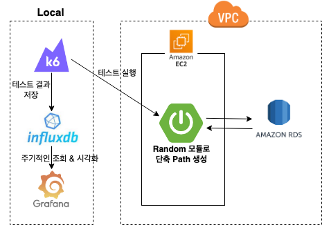
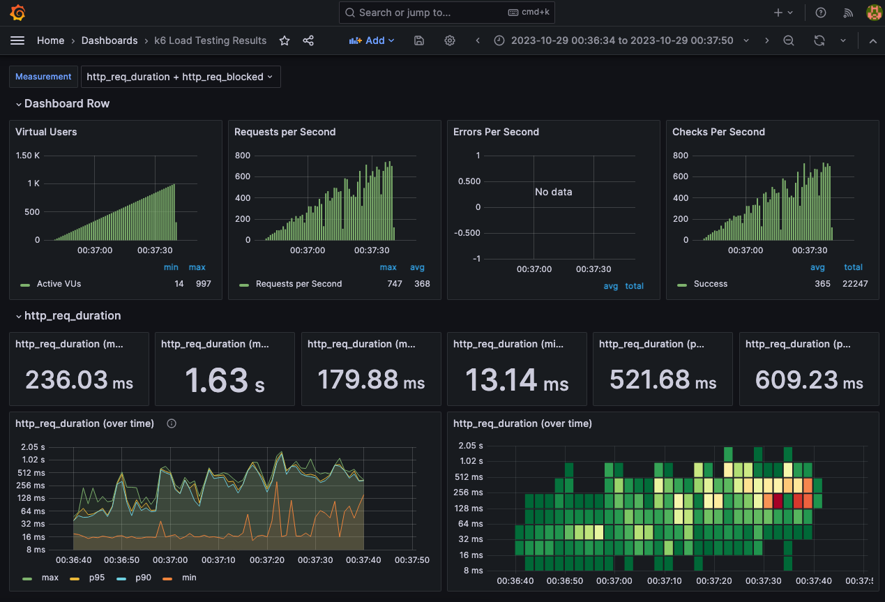
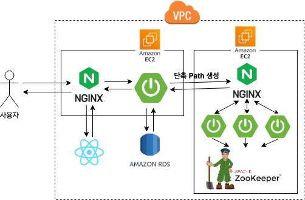
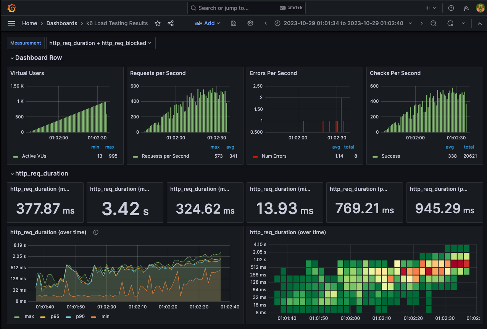
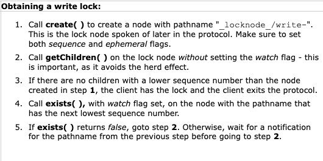
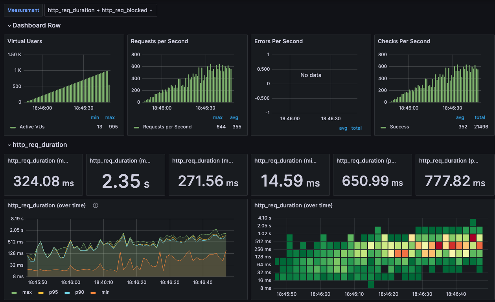
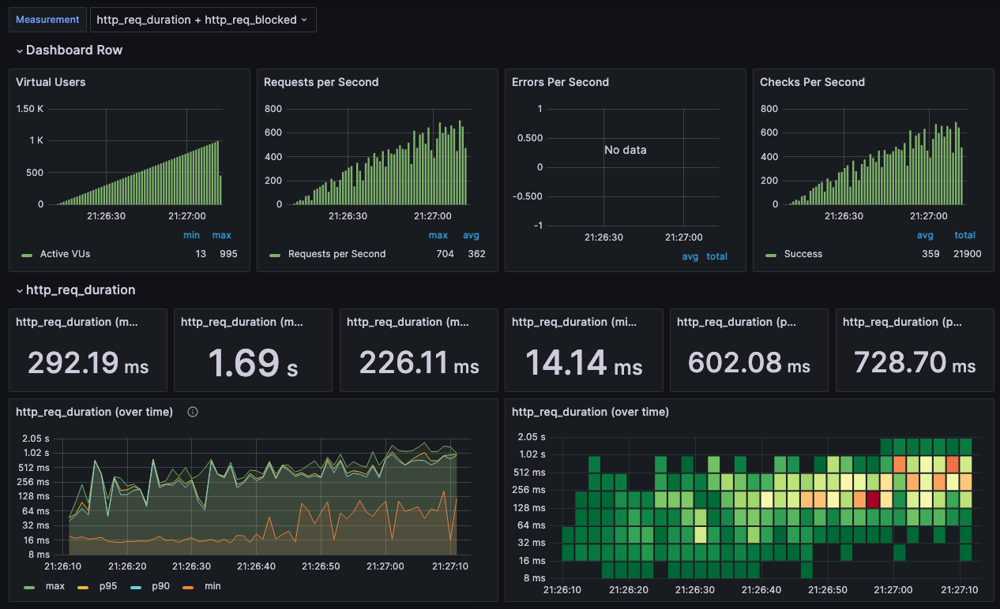

# Link Shortcut Path Generator

### 단축 URL Path 생성 서버 (http://lnsc.me/{Path})
 

## 기술 스택

- Java
- Spring Boot
- Zookeeper
 

## 기능

- API 요청시 고유한 단축 URL Path를 반환
    
  
 

## 기존 서비스 아키텍처에서 Path 생성 방식 변경

- Java의 Random 모듈로 URL Path를 생성하는 방법에서 URL Path 생성 서버를 분리하여 요청을 통해 Path를 생성하는 방식으로 변경하였습니다.
- 변경된 방법은 Zookeeper를 통해 겹치지 않는 구간을 의미하는 offset을 여러 Path 서버들이 할당받은 후, 해당 구간내 랜덤한 단축 Path를 생성합니다.
- 그 후 성능적으로는 어느 정도 차이를 가져오는지, 변경 후 어떤 이점을 얻어냈는지 확인하고자 하였습니다.
    

### 테스트 환경

AWS 상에 테스트 환경을 구성하였습니다.

- **Link Shortcut 메인 서버** (EC2 t2.micro 단일 인스턴스)
- **Zookeeper + 단축 Path 생성 서버** (EC2 t2.micro 단일 인스턴스)
- RDS MySQL t2.micro 단일 인스턴스
    

### 테스트 서버 아키텍처 (변경 전 기준)

- EC2 단일 인스턴스 내 WAS 1개만으로 테스트 진행
    

### 변경 전 테스트 결과

 

## 변경 후 서버 아키텍처

 

## 변경 후 테스트 결과

### 1차 테스트 결과

- 변경 전 보다 성능이 떨어졌고, 에러가 발생한 것을 확인하였습니다.
 

1. **동시성 문제 발생**
    - 원인을 분석해보니 Zookeeper에서 Offset을 가져오는 과정에서 **동시성 문제**가 발생하여, 여러 Path 생성 서버에서 동일한 Offset을 가져와 동일한 Path로 생성하려고 시도하다보니
      에러가 발생했습니다.
    - DB 테이블에서 Path에 Unique 제약 조건을 설정했기 때문에, 동일한 Path로 생성하려고 시도한다면 에러가 발생합니다.
        

    - 검색을 해보니 Zookeeper 공식 문서에 write lock을 구현 방법을 제시해주고 있었으며, 해당 방법으로 구현하여 문제를 해결했습니다.
      
    - 프로젝트에 적용한 커밋 링크 : https://github.com/link-shortcut/path-generator/commit/d4695b761f73f5448aedd4852139c35325431e24
        

2. **생성된 Path를 DB에 저장시 대소문자 무시하는 문제 발생**
    - 그 후에 성능 테스트를 진행했지만 또 에러가 발생했고 원인을 분석해보니, **MySQL에서 varchar 타입이 대소문자를 구분하지 않아, Path에서 충돌이 발생해 예외가 발생**되었고, **단축
      Path 컬럼을 varbinary로 변경**하여 문제를 해결하였습니다.
    - 프로젝트에 적용한 커밋 링크 : https://github.com/link-shortcut/link-shortcut-server/commit/5e91af7ac31a4b21e52dfa1797c77f3179aba413
 

### 2차 테스트 결과 (에러 해결)

- 에러는 해결했지만 여전히 성능적으로 기존 방식보다 약간 떨어진 것을 확인하였습니다.
- 임의의 Path를 1개 생성할 때마다 **매번 API 요청을 해야하기 때문에** 발생하지 않았나 추정하였습니다.
    - HTTP 1.1으로 통신하여 API 호출의 응답 헤더에서 Keep-Alive: timeout=60을 발견하였습니다. 따라서 매 요청시 3 way-handshaking이 발생하여 성능 저하가 발생하지는 않을
      것으로 판단하였습니다.
    - Path 생성 서버에 요청 한번에 다수의 Path를 가져와 단축 URL 서버 내부에 캐시한다면 성능 향상을 기대할 수 있을거라 판단하였습니다. **즉, Path 생성 서버에 요청수를 줄이는 방법을
      선택했습니다.**
 

**깃헙 Commit 링크**

- *Path 생성 서버*
    - https://github.com/link-shortcut/path-generator/tree/d4695b761f73f5448aedd4852139c35325431e24
- *단축 URL 서버*
    - https://github.com/link-shortcut/link-shortcut-server/tree/5e91af7ac31a4b21e52dfa1797c77f3179aba413
 

### 3차 테스트 (내부 캐시 사용으로 최적화)

- 단축 URL 서버에서 요청 한번에 30개의 Path를 가져오도록 구현한 후 테스트를 진행했습니다. (query parameter로 가져오는 개수를 지정할 수 있도록 구현)
- **그 결과 로컬에서 Random 모듈로 생성했을때와 거의 비슷한 성능을 내는 것을 확인할 수 있습니다.**
 

**깃헙 Commit 링크**

- *Path 생성 서버*
    - https://github.com/link-shortcut/path-generator/commit/64ecec9d1793261f8588e1c655cc3570a197b9fe
- *단축 URL 서버*
    - https://github.com/link-shortcut/link-shortcut-server/commit/aebd084f49828e7d88b7fbe510c1cc956a276514
 

## 결론

### 구조 변경으로 얻은 이점

- *기존 구조*
    - Random 모듈로 Path를 생성되어 현재 유효한 단축 URL 개수가 많아질수록 **Path 생성시 충돌 확률이 증가하여 성능이 떨어지거나 장애가 발생**할 수 있습니다.
- *변경 구조*
    - Zookeeper를 통해 할당된 구간의 Path에서 생성하므로, 활성화된 단축 URL의 개수에 관계없이 Path 생성시 충돌 확률이 0%에 수렴합니다.
    - 그 결과 **성능이 일정하게 유지되고 장애 발생 가능성이 작습니다**.
    - Scale Out이 용이하며, 셔플 알고리즘을 사용함에 따라 Path 생성 서버를 더 많이 띄울수록 Load Balancer에 의해 Random한 Path가 생성됩니다.
